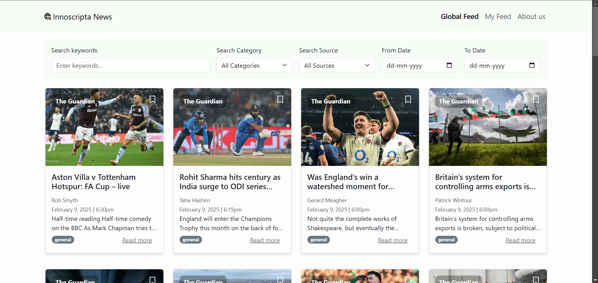

<h1 align="center" id="title">Innoscripta News</h1>

<p id="description">Hi I'm Abdul Mannan Khan. Welcome to my frontend development case study assignment for Innoscripta AG. This is a news web application that fetches news from various sources and offers customizable filtering options. Users can also personalize their news feed based on their preferences.</p>

  
  
<h2>🧐 Features</h2>

Here're some of the project's best features:

*   Customizable Filters to refine the news results
*   Personalization Option allowing users to tailor the news feed according to their preferences

<h2>📸 Project Demo GIF</h2>

<p align="center">
  
  <br>
  <em>Animated GIF showcasing the project workflow</em>
</p>


<h2>🛠️ Installation Steps:</h2>

<p>1. Clone the Repository</p>

```
git clone https://github.com/Abdulmannankhann/Abdul-InnoFront-CS
```

<p>2. Install Dependencies</p>

```
npm install
```

<p>3. Run the Development Server</p>

```
npm run dev
```

  
  
<h2>💻 Built with</h2>

Technologies used in the project:

*   React.js
*   TypeScript
*   Docker

<h2>💖Like my work?</h2>

Let's connect and collaborate! 🚀<p>📧 Email: mannan.khan63@gmail.com</p>